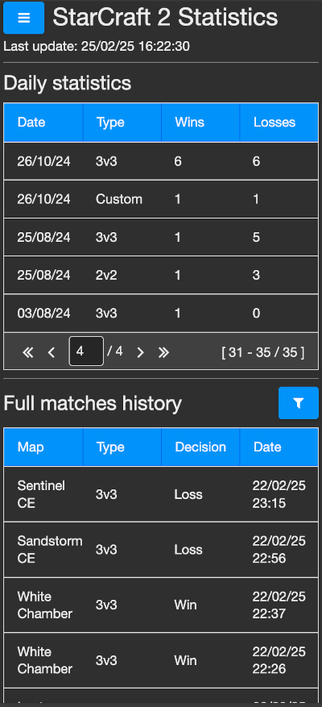
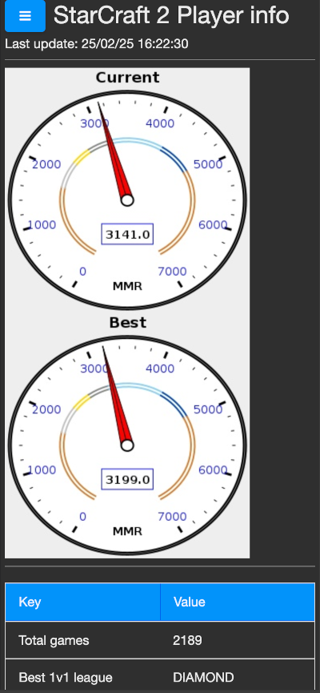

# StarCraft 2 Player Stats

This application allows you to receive and save user StarCraft 2 game statistics using the public Battle Net API

Main advantages:
1. Battle Net gives only the last 25 played matches. The application stores the entire history of matches from the moment the information from Battle Net began to be received
2. The application calculates daily statistics (how many matches per day were won or lost in each of the modes)
3. Visual display of results and MMR

|  |  |
|---------------------------------|---------------------------------|

## How to run

### 1. Dependencies: Java 17 or higher

### 2. Set up next environment variables:

You should get BATTLENET_CLIENTID, BATTLENET_CLIENTSECRET via this guide: https://develop.battle.net/documentation/guides/getting-started

> [!IMPORTANT]
> When you will create api client set up Redirect urls to the next values. It's important for the next steps
> ```
> http://localhost:8084
> http://localhost:8084/battlenet
> ```

Set up next environment variables
```
export BATTLENET_CLIENTID=
export BATTLENET_CLIENTSECRET=
```

For get SC_PLAYERID you need use battlenet-oauth application from this repository:
```
chmod +x battlenet-oauth-2.1.0.jar
./battlenet-oauth-2.1.0.jar
```

In your browser open
```
http://localhost:8084
```

Click on battle.net icon and finish authorization. Clicks on buttons "Request Access Token" and "Request Player Info"

In the table you will view id row. Copy value and set up next environment variables
```
export SC_PLAYERID=
```

#### 3. Run backend and frontend

```
chmod +x sc2stats-backend-2.0.0.jar
./sc2stats-backend-2.0.0.jar &
chmod +x ./sc2stats-frontend-2.0.0.jar 
./sc2stats-frontend-2.0.0.jar &
```

In your browser open 

```
http://localhost
```

Enjoy it!
